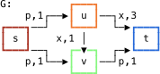
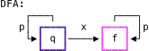

# Usage

This document describes the usage of RegLinker and RegLinkerIO
modules.

## Repository Contents

The following files are likely to be of interest to users:

- `RegLinker.py`: contains the code that implements the RegLinker
  algorithm

- `RegLinkerIO.py`: contains utility functions for reading
  inputs from and writing outputs to disk.

- `examples/network.tsv` and `examples/dfa.tsv`: contains examples of
  graphs that the module RegLinkerIO can interface with. These are as
  tab-separated edge lists of the form
  `head<tab>tail<tab>label<tab>weight`. Note that the graph
  representation of a DFA does not utilize the weight column.

- `examples/net-nodes.tsv` and `examples/dfa-nodes.tsv`: each contains
  a list of sources and targets. In the first, these correspond to
  receptors and transcription factors in the protein interaction
  network. In the second, these correspond to start/final states for
  the DFA. These tab-separated files take the form `node<tab>type`,
  where type is a user-specified designation as to whether the node is
  a source or target. By default, the strings `source` and `target`
  should be used.

## Example

Suppose we have the following toy example network *G*, where an edge
label of *p* indicates that an interaction is annotated to a given
curated pathway, and a label of *x* indicates that an interaction is
not. Here, we designate *s* as a receptor, and *t* as a transcription
factor.



Suppose also, as a regular language constraint, we wish to finds all
the paths in *G* that start with a a *p*-labeled edge, then use an
*x*-labeled edge, then terminate with zero of more *p*-labeled edges.
The DFA corresponding to this regular language is as follow:

In this case, the vertex *q* is the start state, and the vertex *f* is
the final state.



As explained above, files corresponding these networks have been
stored under the `examples` folder. The following Python code will
read them in:

### IO

The file RegLinkerIO.py contains some convenient utility functions for
reading and writing results to disk.

```python
import RegLinker as rl
import RegLinkerIO as rlio

# Open file handles
net_file = open('examples/network.tsv', 'r') 
net_nodes_file = open('examples/net-nodes.tsv', 'r')

dfa_file = open('examples/dfa.tsv', 'r') 
dfa_nodes_file = open('examples/dfa-nodes.tsv', 'r')


# Read networks in. Here, label_col and weight_col refer to the
# 0-indexed column of the corresponding TSV file.

G = rlio.read_graph(net_file, label_col=2, weight_col=3)
S_G, T_G = rlio.read_node_types(net_nodes_file) 

H = rlio.read_graph(dfa_file, label_col=2)
S_H, T_H = rlio.read_node_types(dfa_nodes_file)
```

### RegLinker

The inputs to RegLinker are a set of sources, a set of targets, an
edge-labeled protein interaction network, and the DFA coresponding to
a regular language. RegLinker computes, for each edge in the
interaction network, a shortest path from the set of sources to the
set of targets through that edge, such that each path is *regular
language constrained*: that is, the concatentation of the labels of
the edges along the path forms a word in the specified regular
language. This is achieved through finding paths in an
appropriately-defined product of the interaction network and the DFA.  

Definitions:
- *G*: NetworkX DiGraph representing an interaction network
- *S<sub>G</sub>*: Iterable of sources for *G*
- *T<sub>G</sub>*: Iterable of targets for *G*

- *H*: DFA, represented as a NetworkX DiGraph
- *S<sub>H</sub>*: Iterable of start states for *H* 
- *T<sub>H</sub>*: Iterable of final states *H*

Each edge in *G* and each edge in *H* must be labeled using a common
dictionary attribute. Each edge in *G* must also have a common
attribute to denote an edge weight.

With these inputs in hand, RegLinker can be imported and run as
follows:

```python
import RegLinker as rl

results = rl.RegLinker(G, H, S_G, T_G, S_H, T_H, label="l", weight="w")

```

This will create a generator that yields tuples of the form:

```python
(edge, path, G_path, H_path, labeled_path, cost, rank)
```

Here:
- *edge* is the edge considered
- *path* is the path found in the product graph
- *G\_path\_* and *H\_path\_* are the paths formed by
  projecting the product *path* onto *G* and *H*
- *labeled\_path* is *path*, annotated with edge labels
- *cost* is the sum of the weights of the path
- *rank* is an ordering of the paths, from lowest to highest cost. A
  rank of zero indicates the lowest-cost path.

These tuples are produced in ascending order of rank.

Considering our example networks, it is clear that there are two paths
that fit our desired constraint. The first path (and shortest) is
*s-u-v-t*, and the second is *s-u-t*. Printing the results will yield
the following:

```
>>> for r in results: print(r)
...
((('s', 'q'), ('u', 'q')), [('s', 'q'), ('u', 'q'), ('v', 'f'), ('t', 'f')], ['s', 'u', 'v', 't'], ['q', 'q', 'f', 'f'], [('s', 'u', 'p'), ('u', 'v', 'x'), ('v', 't', 'p')], 3.0, 0)
((('u', 'q'), ('v', 'f')), [('s', 'q'), ('u', 'q'), ('v', 'f'), ('t', 'f')], ['s', 'u', 'v', 't'], ['q', 'q', 'f', 'f'], [('s', 'u', 'p'), ('u', 'v', 'x'), ('v', 't', 'p')], 3.0, 0)
((('v', 'f'), ('t', 'f')), [('s', 'q'), ('u', 'q'), ('v', 'f'), ('t', 'f')], ['s', 'u', 'v', 't'], ['q', 'q', 'f', 'f'], [('s', 'u', 'p'), ('u', 'v', 'x'), ('v', 't', 'p')], 3.0, 0)
((('u', 'q'), ('t', 'f')), [('s', 'q'), ('u', 'q'), ('t', 'f')], ['s', 'u', 't'], ['q', 'q', 'f'], [('s', 'u', 'p'), ('u', 't', 'x')], 4.0, 1)
```

The output consists of four lines, corresponding to the four edges
through which we were able to find an *s-t* path in *G* conforming to
our constraints. 
